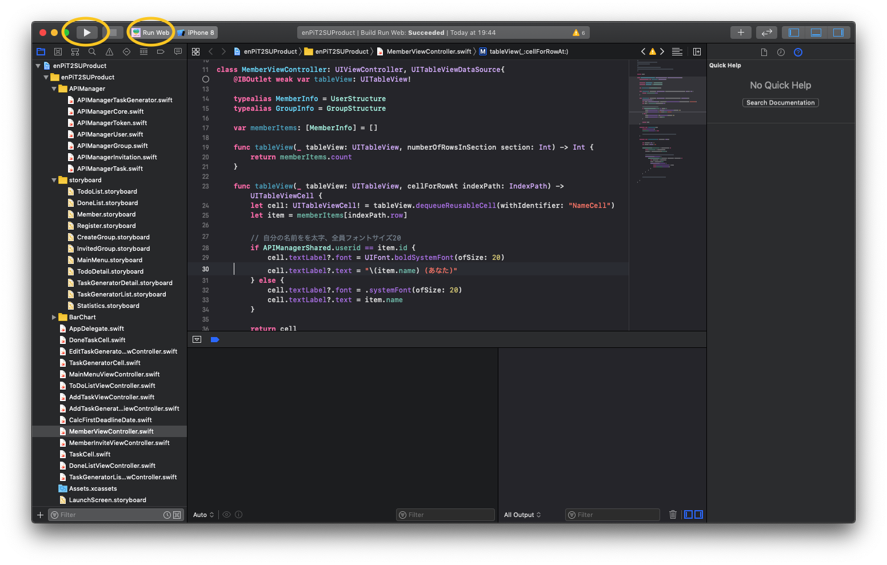
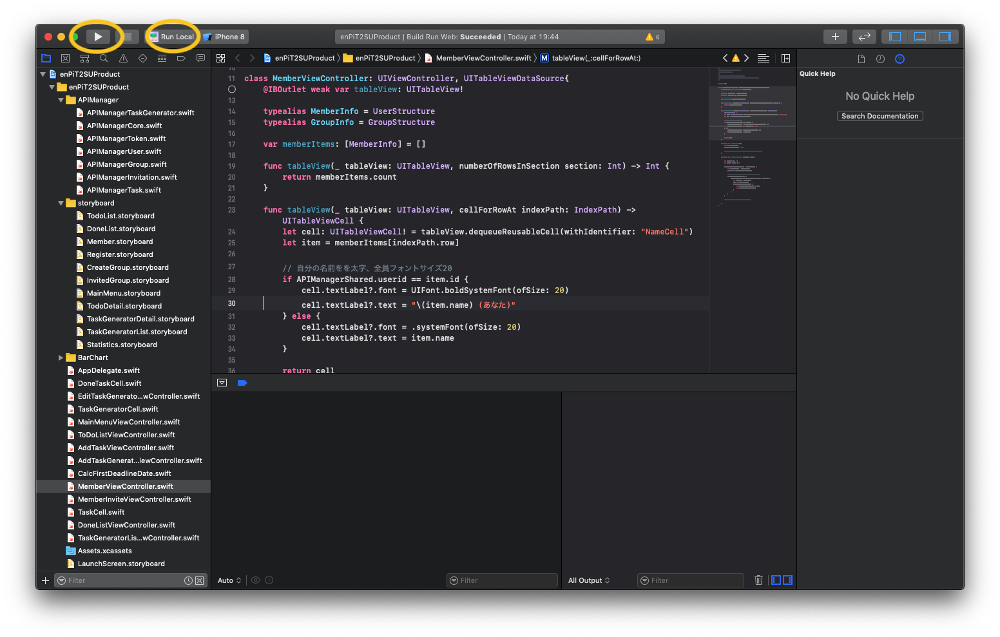

# Lovelabを使う

- [公開しているWebサーバを使う方法](#公開しているWebサーバを使う方法)
- [ローカルにサーバを構築する方法](#ローカルにサーバを構築する方法)

## 公開しているWebサーバを使う方法

### 前提

以下がインストールされていることが前提

- [Git](https://git-scm.com/download/mac)
- [Xcode](https://itunes.apple.com/jp/app/xcode/id497799835?mt=12) Version 11.3

### iPhoneアプリのリポジトリを取得する

```sh
$ git clone https://github.com/enpit2su-ics/2019-team-C.git
$ cd 2019-team-C
$ open /Applications/Xcode.app enPiT2SUProduct.xcodeproj/
```

### 実行する

Schema「Run Web」を選択し、実行する。



アプリ起動後の使い方は[enpit2su-ics/2019-team-C/03-HowToUse.md](https://github.com/enpit2su-ics/2019-team-C/blob/master/03-HowToUse.md)を参照のこと。

## ローカルにサーバを構築する方法

### 前提

以下がインストールされていることが前提

- [Git](https://git-scm.com/download/mac)
- [Xcode](https://itunes.apple.com/jp/app/xcode/id497799835?mt=12) Version 11.3
- [Docker for Mac](https://docs.docker.com/docker-for-mac/)
- [docker-compose](http://docs.docker.jp/compose/install.html)

### APIサーバを実行する

```sh
# リポジトリを取得
$ git clone https://github.com/basd4g/lovelab-api.git
$ cd lovelab-api

# 環境変数を設定
$ cp .env.example .env

# 起動
$ docker-compose up
```

ブラウザで[localhost/api/v1](http://localhost/api/v1)を開いて、`{"running":true,"message":"Hello,lovelab. This API server is running."}`が表示されたら正常に起動できている。

参考: [Dockerコンテナの操作についての詳細](./docker.md)

### iPhoneアプリのリポジトリを取得する

```sh
$ git clone https://github.com/enpit2su-ics/2019-team-C.git
$ cd 2019-team-C
$ open /Applications/Xcode.app enPiT2SUProduct.xcodeproj/
```

### 実行する

Schema「Run Local」を選択し、実行する。



アプリ起動後の使い方は[enpit2su-ics/2019-team-C/03-HowToUse.md](https://github.com/enpit2su-ics/2019-team-C/blob/master/03-HowToUse.md)を参照のこと。

